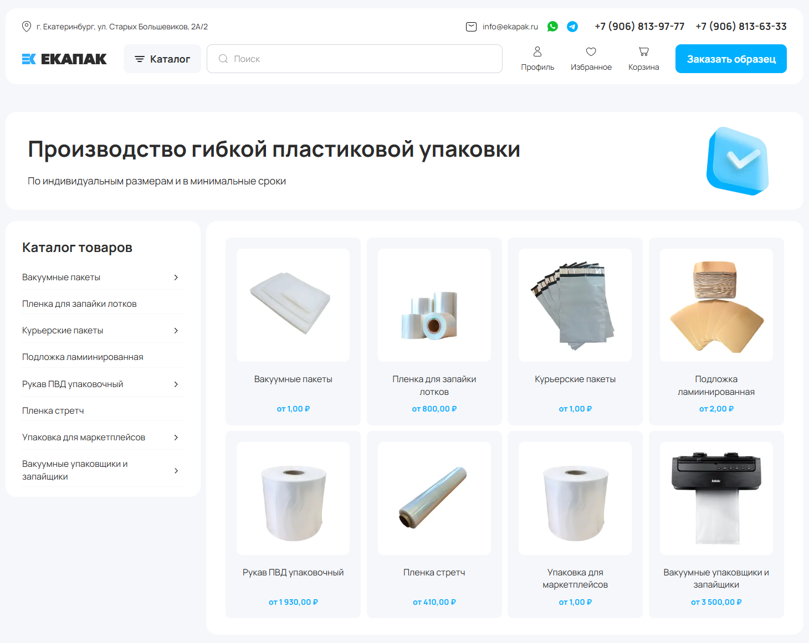

## 🛠 Стек

| Категория             | Технология                      |
| --------------------- | ------------------------------- |
| Фреймворк             | Next.js 16.1.1                  |
| UI-библиотека         | React 19.2.3                    |
| Стилизация            | Tailwind CSS v4                 |
| Управление состоянием | Redux Toolkit + React Redux     |
| Асинхронные запросы   | TanStack Query (React Query)    |
| Типизация             | TypeScript 5                    |
| Линтинг               | ESLint 9 + `eslint-config-next` |
| Утилиты               | lodash, clsx                    |
| Менеджер пакетов      | npm                             |

## 🧰 Требования

Для корректной работы и разработки проекта необходимы следующие версии инструментов:

| Инструмент  | Минимальная версия |
| ----------- | ------------------ |
| **Node.js** | `>=20.x`           |
| **npm**     | `>=10.x`           |

> 💡 Проверить версии:
>
> ```bash
> node -v
> npm -v
> ```

## ▶️ Быстрый старт

1. Клонируйте репозиторий

   ```bash
   git clone git@github.com:tailwindlabs/tailwindcss.git
   cd ekapak-frontend
   ```

2. Установите зависимости

   ```bash
   npm install
   ```

3. Запустите dev-сервер

   ```bash
   npm run dev
   ```
